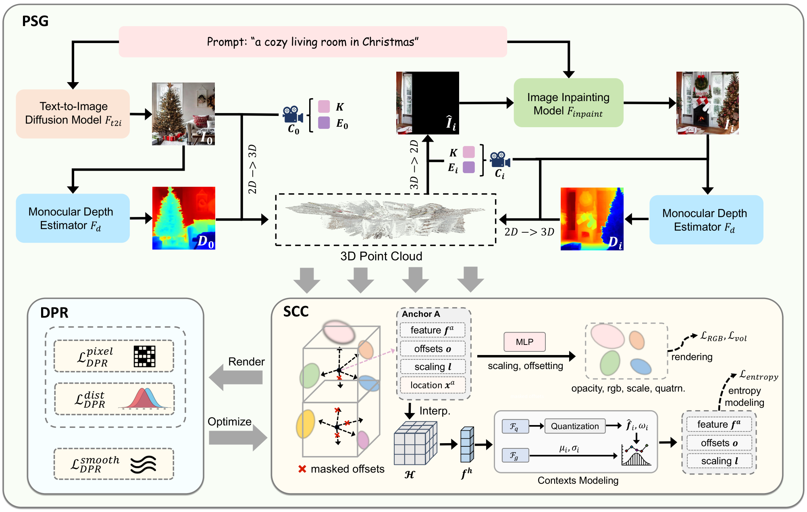

##  BloomScene
The official implementation of AAAI 2025 paper ''BloomScene: Lightweight Structured 3D Gaussian Splatting for Crossmodal Scene Generation''.


> ### [BloomScene: Lightweight Structured 3D Gaussian Splatting for Crossmodal Scene Generation](#)
> **Xiaolu Hou***, **Mingcheng Li***, Dingkang Yang, Jiawei Chen, Ziyun Qian, Xiao Zhao, Yue Jiang, Jinjie Wei, Qingyao Xu, Lihua Zhang  
> *Accepted by AAAI 2025*

## Abstract
With the widespread use of virtual reality applications, 3D scene generation has become a new challenging research frontier. 3D scenes have highly complex structures and need to ensure that the output is dense, coherent, and contains all necessary structures. Many current 3D scene generation methods rely on pre-trained text-to-image diffusion mod- els and monocular depth estimators. However, the generated scenes occupy large amounts of storage space and often lack effective regularisation methods, leading to geometric distor- tions. To this end, we propose BloomScene, a lightweight structured 3D Gaussian splatting for crossmodal scene gener- ation, which creates diverse and high-quality 3D scenes from text or image inputs. Specifically, a crossmodal progressive scene generation framework is proposed to generate coherent scenes utilizing incremental point cloud reconstruction and 3D Gaussian splatting. Additionally, we propose a hierarchi- cal depth prior-based regularization mechanism that utilizes multi-level constraints on depth accuracy and smoothness to enhance the realism and continuity of the generated scenes. Ultimately, we propose a structured context-guided compres- sion mechanism that exploits structured hash grids to model the context of unorganized anchor attributes, which signif- icantly eliminates structural redundancy and reduces stor- age overhead. Comprehensive experiments across multiple scenes demonstrate the significant potential and advantages of our framework compared with several baselines.

## Getting Started
We provide pretrained image inpainting model. The download URLs are as follows:

- Baidu Disk URL for [Image inpainting model (Runway)](https://pan.baidu.com/s/1kK110nhCK5maU1_oD-06yw?pwd=1pd2)

- Google Drive for [Image inpainting model (Runway)](https://drive.google.com/drive/folders/1tP--db0MJtx1oaIRp-OU2hR0fzP_gWmm?usp=sharing)

Please download the model file and put it under `./BloomScene/models--runwayml--stable-diffusion-inpainting`

## Install
### Ubuntu
We tested our code on a server with Ubuntu 18.04, CUDA 11.4, gcc 9.4.0

#### Installation script

```bash
conda env create --file environment.yml 
conda activate bloomscene
# torch-scatter
Download https://data.pyg.org/whl/torch-2.0.0%2Bcu117/torch_scatter-2.1.2%2Bpt20cu117-cp39-cp39-linux_x86_64.whl
pip install <path_to_the_whl_file>

cd submodules/depth-diff-gaussian-rasterization
python setup.py install
cd ../simple-knn
python setup.py install
cd ../gridencoder
python setup.py install
cd ../..
```

#### Run with your own samples
```bash
# Default Example
python run.py --image <path_to_image> --text <path_to_text_file>  [Other options] 
``` 
- Replace <path_to_image> and <path_to_text_file> with the paths to your image and text files.


<details>
  <summary>Other options</summary>

  - `--image`: Input image for scene generation.
  - `--text`: Text prompt for scene generation.
  - `--neg_text`: Optional. Negative text prompt for scene generation.
  - `--lambdae`: Optional. Try variable bitrate.
  - `--seed`: Manual seed for reproducibility.
  - `--dep_value`: Pixel-level depth regularization.
  - `--dep_value_lbd`: lambda for pixel-level depth regularization.
  - `--dep_domin`: Distribution-level depth regularization.
  - `--dep_domin_lbd`: lambda for distribution-level depth regularization.
  - `--dep_smooth`: Depth smoothness regularization.
  - `--dep_smooth_lbd`: lambda for depth smoothness regularization.
  - `--diff_steps`: Optional. Number of inference steps for running Stable Diffusion Inpainting.
  - `--save_dir`: Optional. Directory to save the generated scenes and videos. Specify to organize outputs.
  - `--campath_gen`: Camera path for scene generation (options: `rotate360`).
  - `--campath_render`: Camera path for video rendering (options: `rotate360`).
</details>


<!-- ## Updates

- ✅ Code release!
- ✅  on [arXiv](). -->


## Acknowledgement

Many thanks to [LucidDreamer](https://github.com/luciddreamer-cvlab/LucidDreamer), [ZoeDepth](https://github.com/isl-org/ZoeDepth), [3DGS](https://github.com/graphdeco-inria/gaussian-splatting), [Scaffold-GS](https://github.com/city-super/Scaffold-GS), [HAC](https://github.com/YihangChen-ee/HAC) and Runway for their excellent codebase.